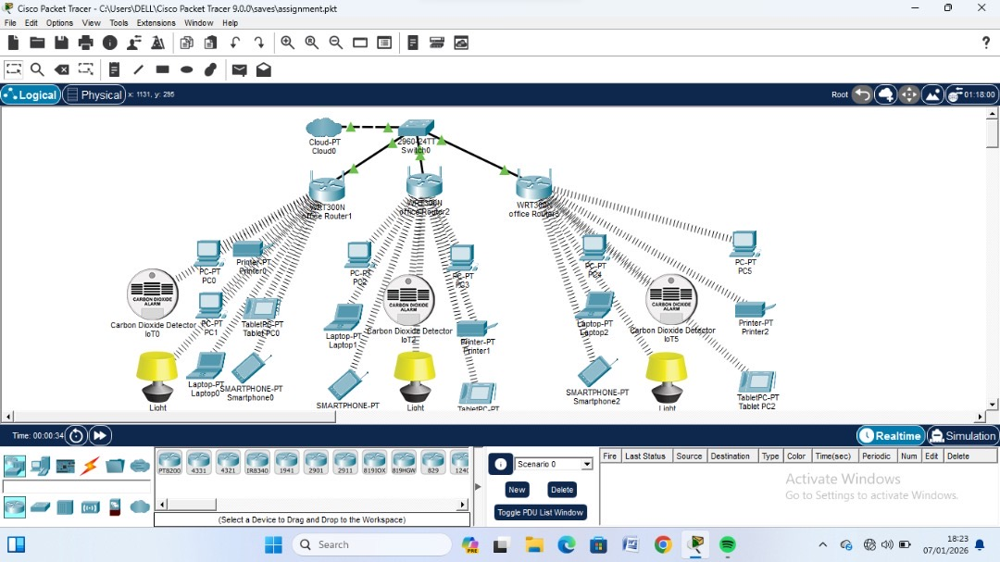

# 🖧 Cisco Packet Tracer Labs

Network topology design and simulation labs built using
Cisco Packet Tracer 9.0.

---

## Lab 1: Segmented Office Network

### Overview
Designed and simulated a segmented office network 
consisting of three office zones connected through a 
central switch and cloud infrastructure.

### Topology Details
- **Core:** Cisco 2960-24TT Switch + Cloud-PT
- **Routers:** 3x WRT300N Wireless Routers (one per office zone)
- **End Devices per zone:** PCs, Laptops, Tablets, Smartphones, Printers
- **IoT Devices:** Carbon Dioxide Detectors, Smart Lights

### Skills Demonstrated
- Network segmentation across multiple office zones
- Wireless router configuration
- IoT device integration into a network topology
- Logical network design using Cisco Packet Tracer 9.0

### Date
January 7, 2026
