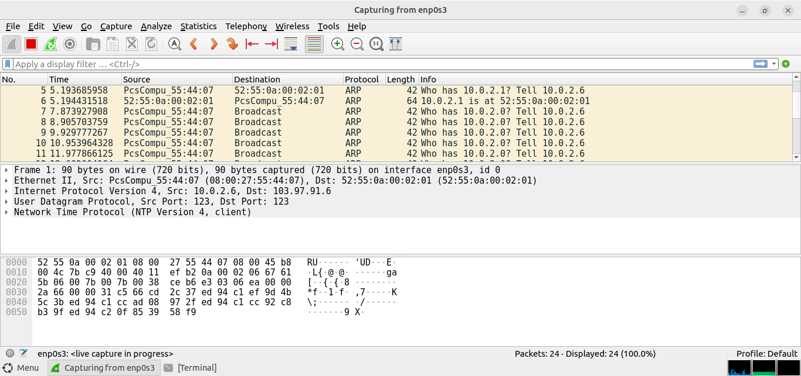
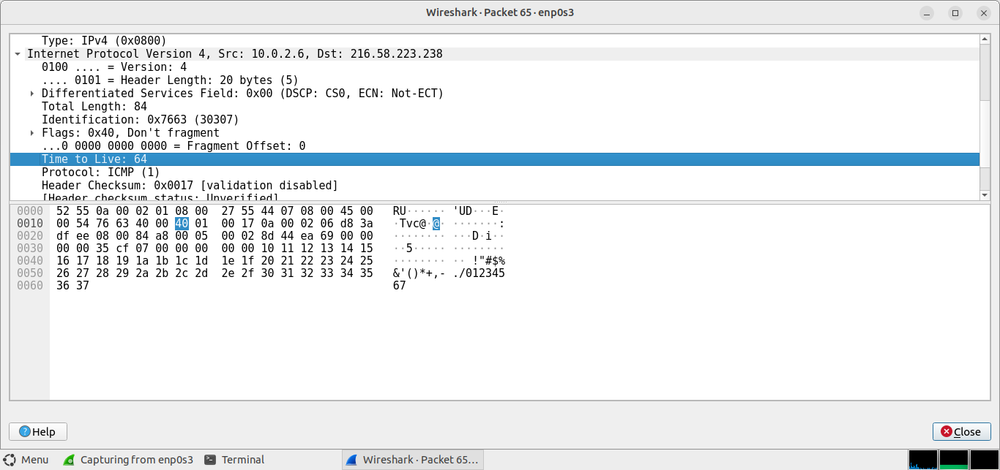
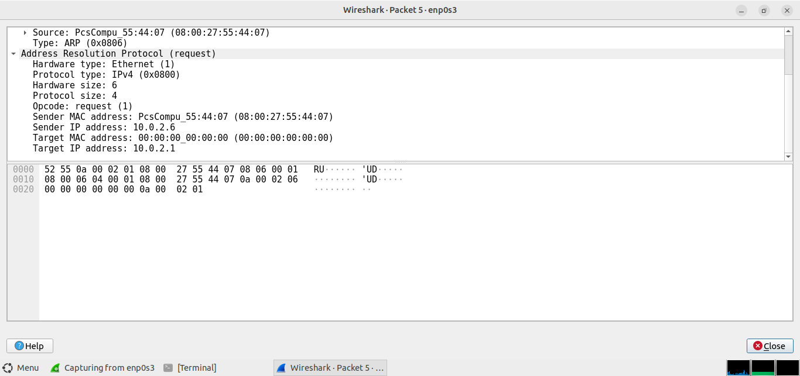
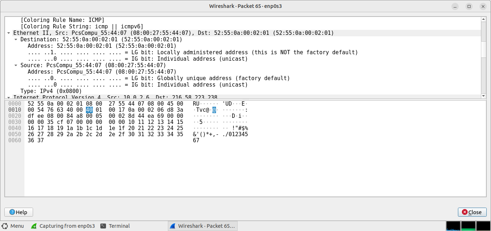
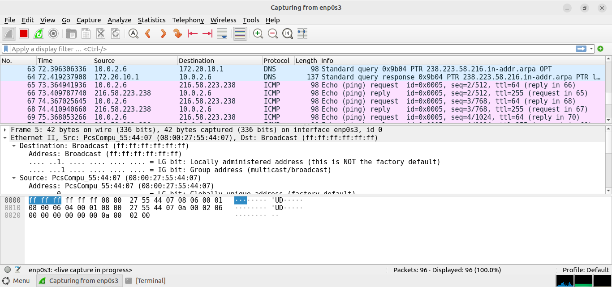
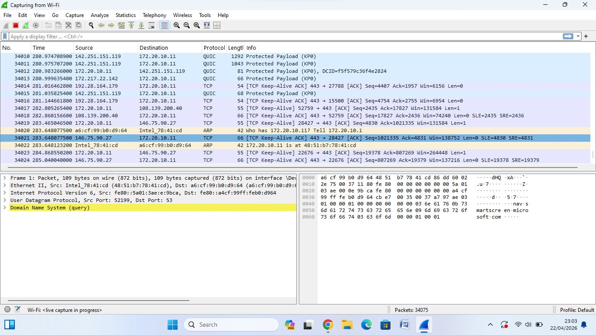
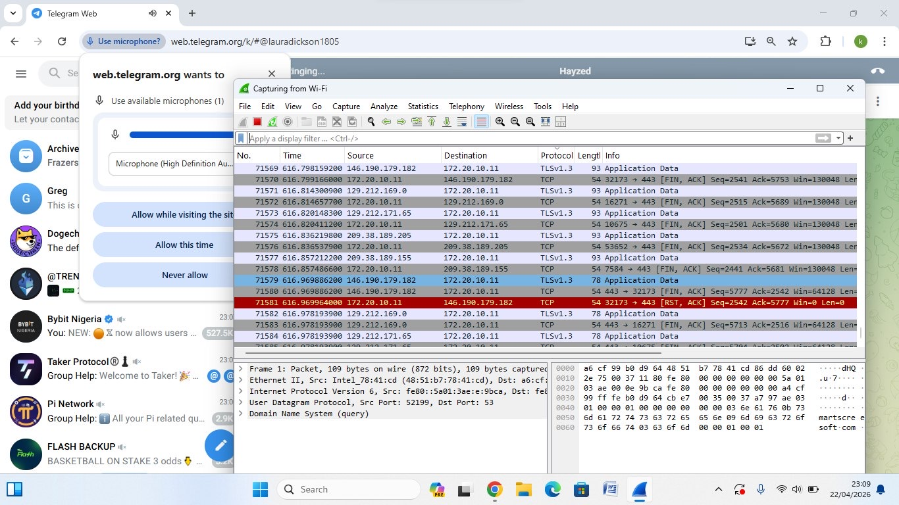
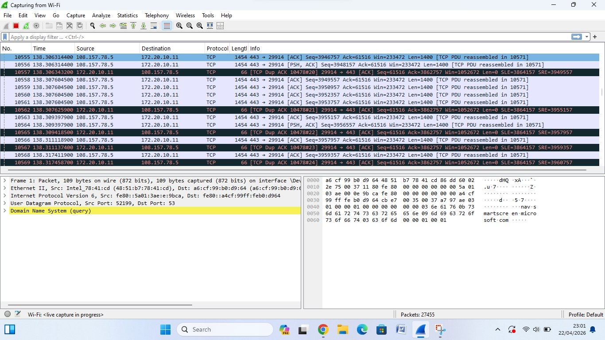

# 🦈 Wireshark — Packet Capture Analysis

Hands-on packet capture and traffic analysis using Wireshark
across two different network interfaces.

---

## Lab 1: Linux Interface Capture (enp0s3)

### Overview
Live packet capture performed on a Linux machine via the
enp0s3 interface, analyzing ARP, NTP, and ICMP traffic.

### Protocols Observed
- **ARP** — Address resolution requests and replies between
  10.0.2.6 and 10.0.2.1
- **NTP** — Network Time Protocol traffic from 10.0.2.6
  to 103.97.91.6 on UDP port 123
- **ICMP** — Ping requests and replies between 10.0.2.6
  and 216.58.223.238 (Google)

### Key Findings
- ARP broadcast storms observed — host repeatedly
  querying for 10.0.2.0
- ICMP echo requests confirmed live connectivity to
  external IP
- TTL value of 64 observed on outgoing ICMP packets

### Screenshots

---

## Lab 2: Wi-Fi Interface Capture (Windows)
**Date:** April 22, 2026

### Overview
Live packet capture on a Windows machine via Wi-Fi
interface, analyzing encrypted and unencrypted traffic
across multiple protocols.

### Protocols Observed
- **TCP** — Keep-Alive packets and FIN/ACK connection
  termination sequences
- **TLSv1.3** — Encrypted application data over HTTPS
- **QUIC** — Google's encrypted transport protocol
- **ARP** — Local network address resolution
- **DNS** — Domain Name System query to resolve
  microsoft.com

### Key Findings
- TCP RST/ACK packet observed indicating abrupt
  connection termination
- DNS query captured resolving microsoft.com via
  UDP port 53
- TLSv1.3 traffic confirmed encrypted communication
  to multiple external servers
- QUIC protocol traffic observed indicating modern
  web application usage

### Screenshots

