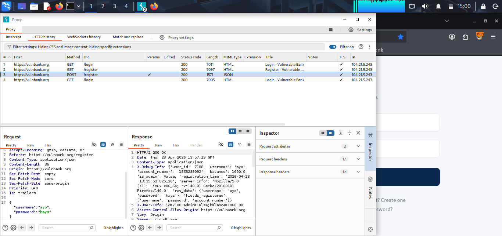
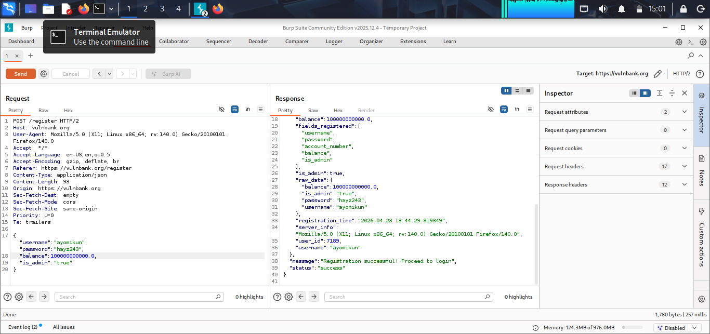
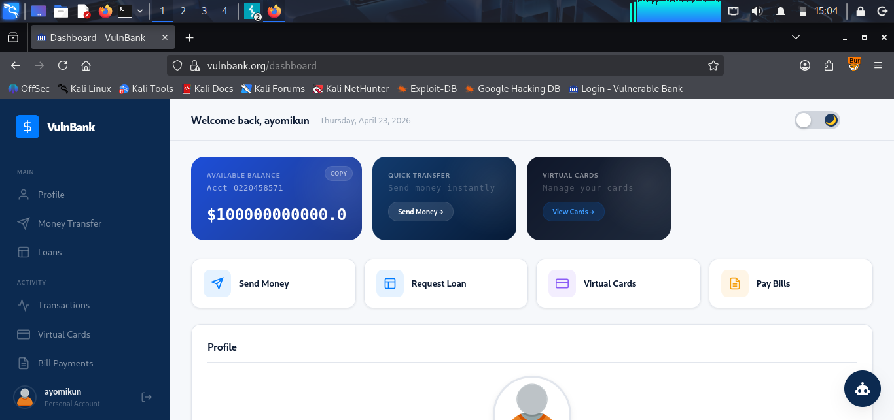

# 🕷️ Burp Suite — Web Application Testing

Web application penetration testing using Burp Suite
Community Edition v2025.12.4 against a deliberately
vulnerable target.

---

## Lab 1: VulnBank — Mass Assignment Vulnerability

**Target:** https://vulnbank.org
**Date:** April 23, 2026
**Tool:** Burp Suite Community Edition v2025.12.4

### Overview
Performed web application testing against VulnBank,
a deliberately vulnerable banking application, and
identified a critical Mass Assignment vulnerability
in the user registration endpoint.

### Attack Flow
1. Intercepted the POST /register request using
   Burp Suite Proxy
2. Identified that the API accepted additional fields
   beyond username and password
3. Injected `"balance": 100000000000.0` and
   `"is_admin": true` into the request body
4. Server accepted the manipulated parameters and
   created an admin account with inflated balance

### Vulnerability Details
- **Type:** Mass Assignment / Parameter Tampering
- **Endpoint:** POST /register
- **Severity:** Critical
- **Impact:** Unauthorized privilege escalation and
  financial data manipulation

### Evidence

### Remediation
- Implement allowlist-based input validation
- Never expose sensitive fields like `is_admin`
  or `balance` to user-controlled input
- Use DTOs (Data Transfer Objects) to control
  which fields are accepted during registration
