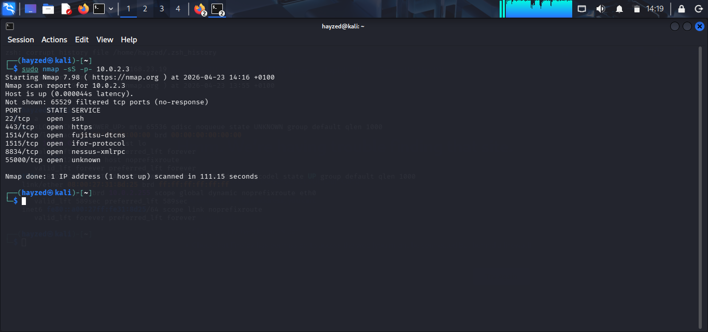

# 🔍 Nmap — Reconnaissance & Port Scanning

Network reconnaissance and port scanning labs performed
using Nmap on Kali Linux.

---

## Lab 1: Full TCP Port Scan — 10.0.2.3

**Target:** 10.0.2.3
**Date:** April 23, 2026
**Command:** `sudo nmap -sS -p- 10.0.2.3`
**Tool:** Nmap 7.98

### Overview
Performed a full TCP SYN stealth scan across all 65535
ports against an internal host to enumerate open services.

### Scan Results

| Port | State | Service |
|---|---|---|
| 22/tcp | open | SSH |
| 443/tcp | open | HTTPS |
| 1514/tcp | open | fujitsu-dtcns |
| 1515/tcp | open | ifor-protocol |
| 8834/tcp | open | nessus-xmlrpc |
| 55000/tcp | open | unknown |

### Analysis
- **Port 22 (SSH):** Remote access service — should be
  restricted to authorised IPs only
- **Port 443 (HTTPS):** Secure web service running
- **Port 8834 (Nessus):** Nessus vulnerability scanner
  management interface detected — confirms this is a
  security lab environment
- **Port 55000:** Unknown service — requires further
  investigation
- 65529 filtered ports indicate firewall is active

### Scan Type
`-sS` SYN stealth scan — sends SYN packets without
completing the TCP handshake, making it less detectable
than a full connect scan.

### Screenshot

