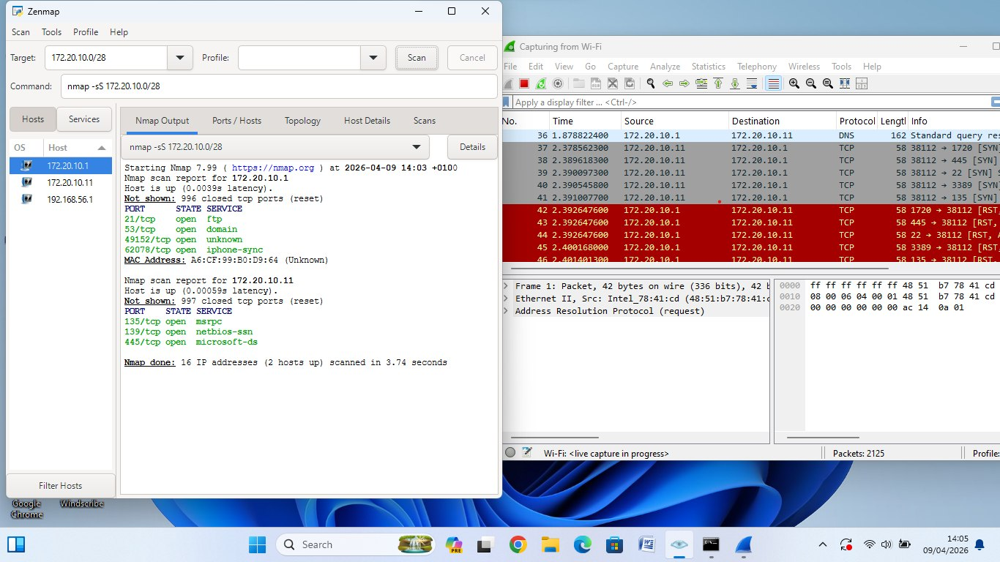

---

## Lab 2: Network Scan for Open Ports — 172.20.10.0/28

**Date:** April 9, 2026
**Command:** `nmap -sS 172.20.10.0/28`
**Tool:** Nmap 7.99 + Zenmap + Wireshark
**Scan Type:** SYN Stealth Scan
**Scope:** 16 IP addresses — 2 hosts up, 14 down

### Scan Results

#### Host 1 — 172.20.10.1
**MAC Address:** A6:CF:99:B0:D9:64
**Latency:** 0.0039s

| Port | State | Service |
|---|---|---|
| 21/tcp | open | FTP |
| 53/tcp | open | DNS |
| 49152/tcp | open | Unknown |
| 62078/tcp | open | iPhone Sync |

#### Host 2 — 172.20.10.11
**Latency:** 0.00059s

| Port | State | Service |
|---|---|---|
| 135/tcp | open | MSRPC |
| 139/tcp | open | NetBIOS-SSN |
| 445/tcp | open | Microsoft-DS (SMB) |

### Security Risks Identified

| Service | Risk |
|---|---|
| FTP (Port 21) | Transmits credentials in plaintext — susceptible to credential interception |
| DNS (Port 53) | Vulnerable to DNS spoofing and cache poisoning attacks |
| SMB (Port 445) | Allows lateral movement across the network — common ransomware vector |

### Wireshark Correlation
Wireshark capture confirmed SYN packets from
172.20.10.11 to 172.20.10.1 across multiple ports
during the scan, with RST/ACK responses on closed
ports — consistent with a SYN stealth scan pattern.

### Screenshot

### Scan Output File
📄 [View Raw Nmap XML Output](./task1.html)

