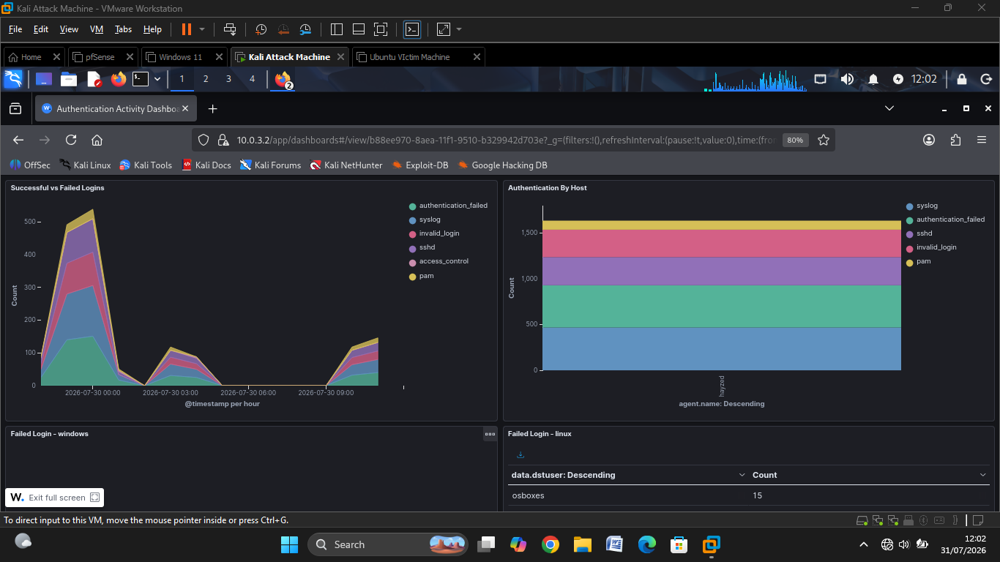
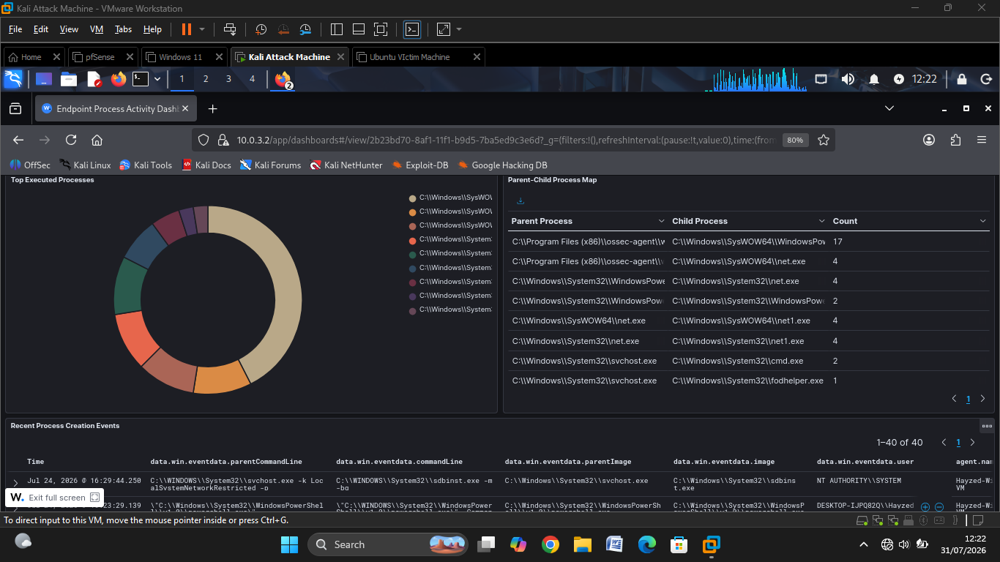
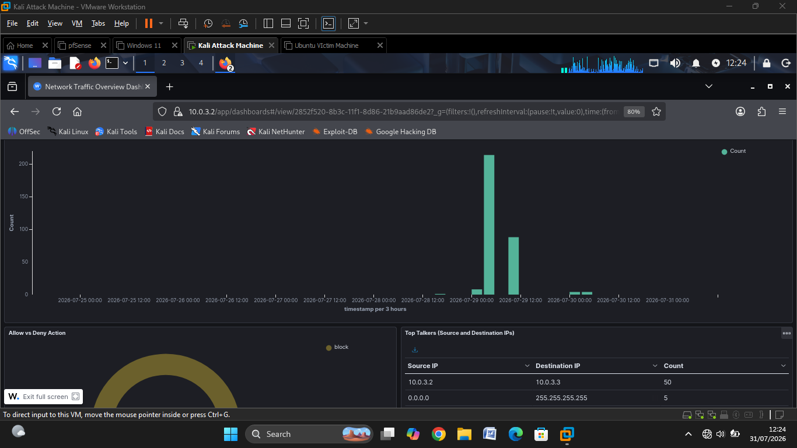
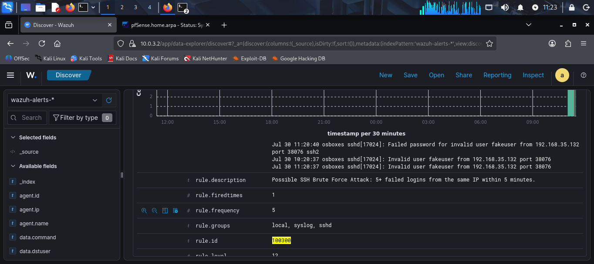
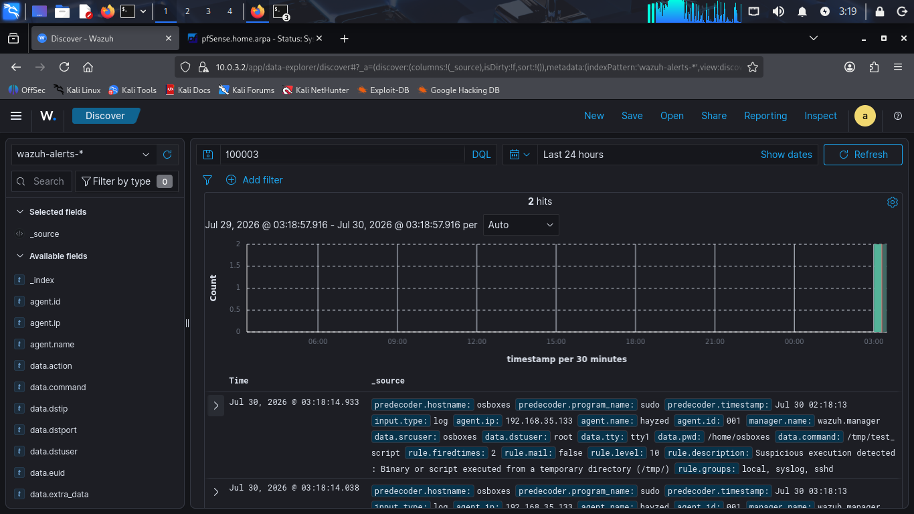
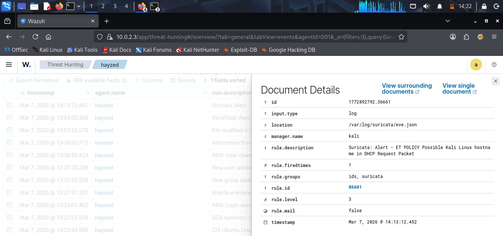
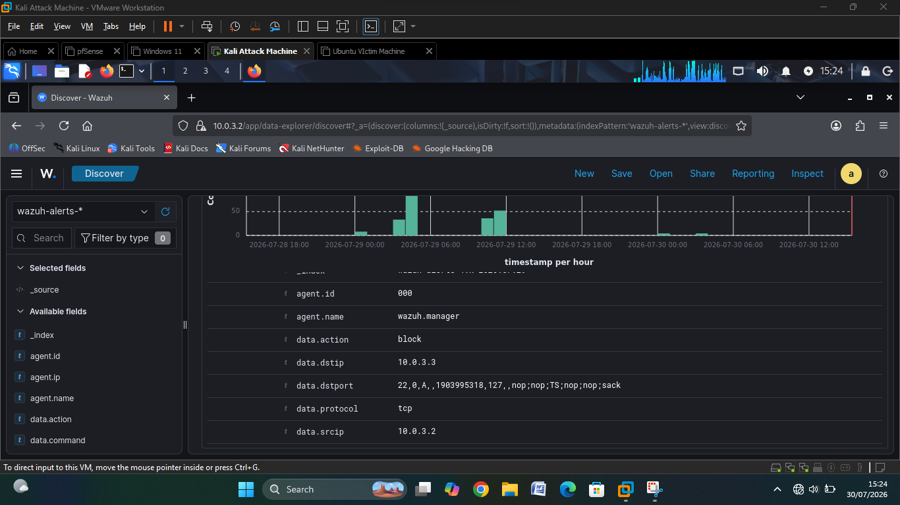
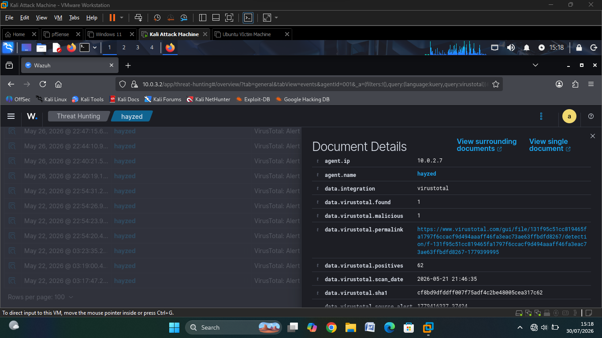
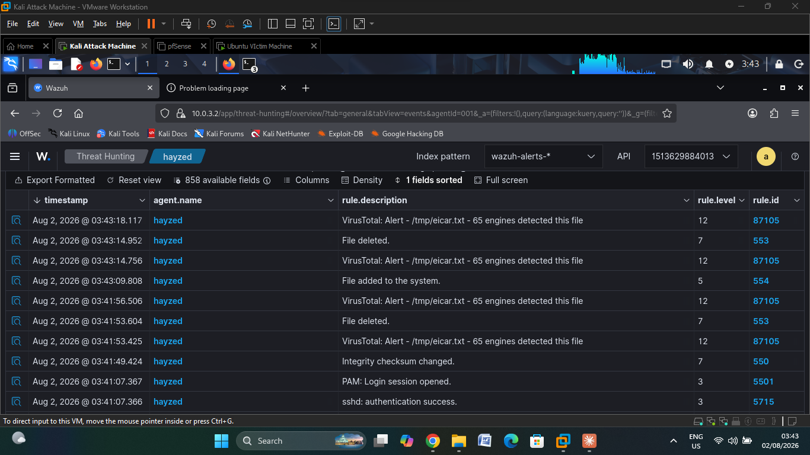
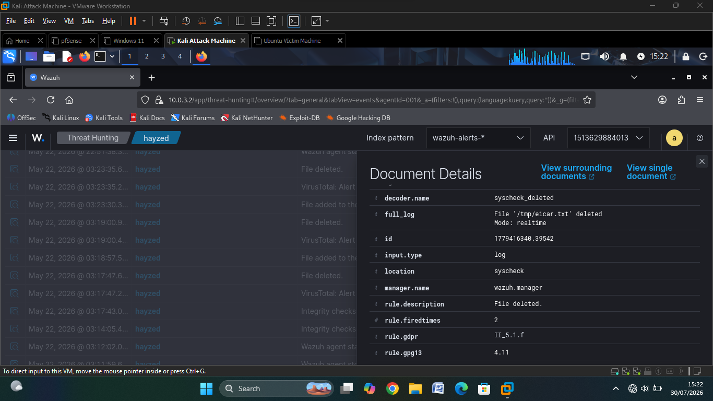

# Screenshots

Supporting screenshots for the SOC Home Lab project. See the [main README](../README.md) for full project context, and the [full report](../SOC%20Home%20Lab%20Report.pdf) for detailed analysis of each alert.

---

## Dashboards

### Authentication Activity Dashboard

### Endpoint Process Activity Dashboard

### Network Traffic Overview Dashboard

---

## Detection Alerts

### SSH Brute-Force Detection

### Suspicious Process Execution

### Suricata IDS Alert

### pfSense Firewall Alert

---

## Threat Intelligence & Automated Response

### VirusTotal Enrichment

### VirusTotal + Active Response (Detect → Analyze → Respond)

### Active Response, Malicious File Removed

