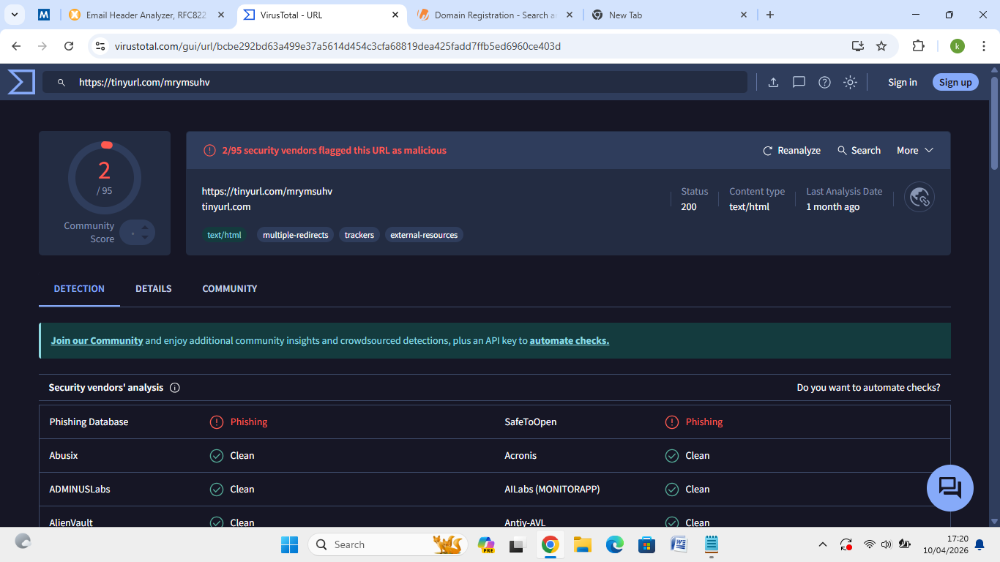
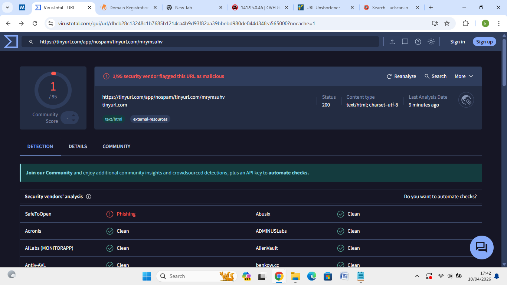

# 🎣 Phishing Email Analysis

**Date:** October 4, 2026
**Tools Used:** MXToolbox, VirusTotal
**Classification:** Phishing Attack ✅ Confirmed

---

## Executive Summary

Analyzed a suspicious email claiming to be from
"OneCasino" regarding a welcome gift of 50 free spins.
Based on email header analysis and VirusTotal threat
intelligence, this email has been classified as a
confirmed phishing attack. The sender infrastructure
and embedded links show clear malicious intent.

---

## Sender Information & Header Analysis

| Field | Value |
|---|---|
| Display Name | OneCasino |
| Actual Sender | 132784@534617.vav.proo55.us.com |
| Source IP | 141.95.0.46 |
| Return Path | bounce@vav.proo55.us.com |
| Geographic Origin | France (EU) — OVH SAS (AS16276) |
| Date Sent | Wed, 28 Jan 2026 22:49:43 +0000 |

### Authentication Results

| Check | Result |
|---|---|
| DMARC | ❌ No DMARC Record Found |
| SPF Alignment | ✅ Pass |
| SPF Authentication | ✅ Pass |
| DKIM Alignment | ❌ Failed |
| DKIM Authentication | ✅ Pass |

---

## Technical Findings — IP Reputation

Performed a reputation check on source IP **141.95.0.46**
using VirusTotal:

| Vendor | Verdict |
|---|---|
| alphaMountain.ai | Phishing |
| Webroot | Malicious |
| Criminal IP | Malicious |
| Total Detections | 3/94 vendors |

**Verdict:** ⚠️ Confirmed malicious infrastructure

---

## Link & Social Engineering Analysis

The email used a financial incentive (free spins) to
lure the recipient into clicking a malicious link.

| IOC | Value |
|---|---|
| Original Link | https://tinyurl.com/mrymsuhv |
| VirusTotal (Short Link) | 2/95 — Phishing |
| Unshortened Destination | https://tinyurl.com/app/nospam/tinyurl.com/mrymsuhv |
| VirusTotal (Destination) | 1/95 — Phishing |

---

## Phishing Indicators

- **Spoofed Identity** — Sender domain does not match
  any official OneCasino brand domain
- **Suspicious Infrastructure** — Email sent from a
  generic VPS in France rather than a corporate mail
  server
- **URL Masking** — TinyURL shortener used to hide a
  destination flagged by multiple security engines
- **Inconsistent Authentication** — No DMARC record
  and mismatched From address despite SPF pass
- **Social Engineering** — Financial incentive used
  to create urgency and interest

---

## Conclusion

The combination of malicious IP reputation, flagged
URLs, and identity impersonation confirms this is a
phishing attack. Recommended actions:

- Block sender domain and IP at the email gateway
- Add 141.95.0.46 to the organization blocklist
- Add TinyURL destinations to URL filtering rules
- Report to abuse contact for OVH SAS (AS16276)

---

## Screenshots

