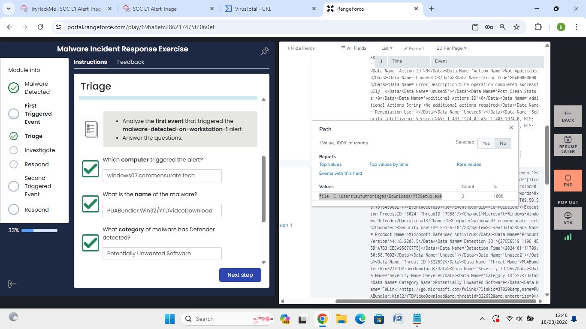
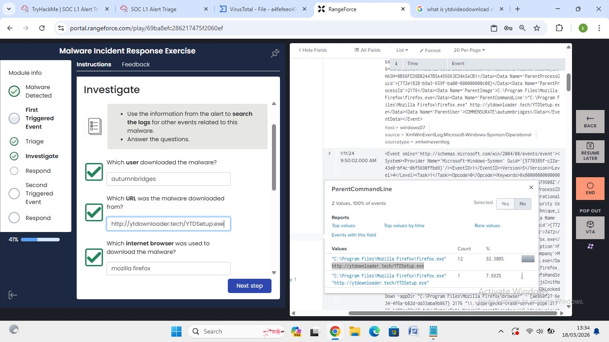
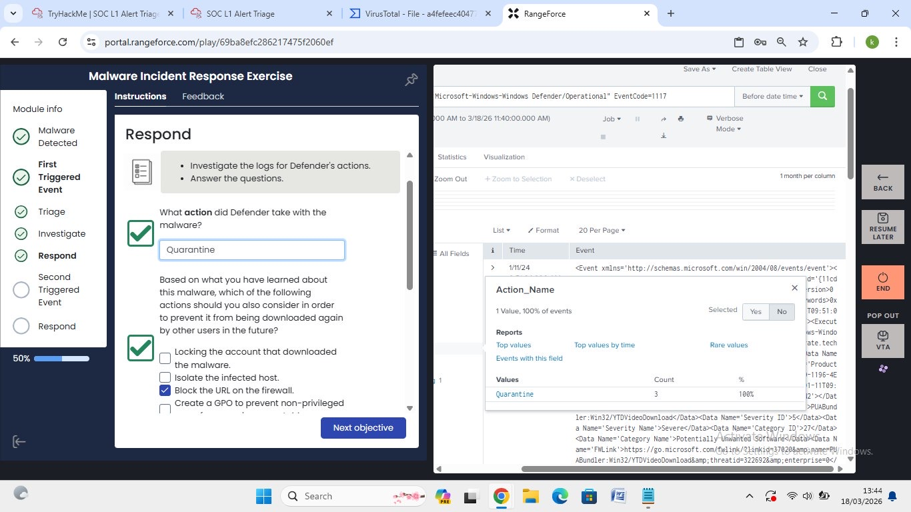
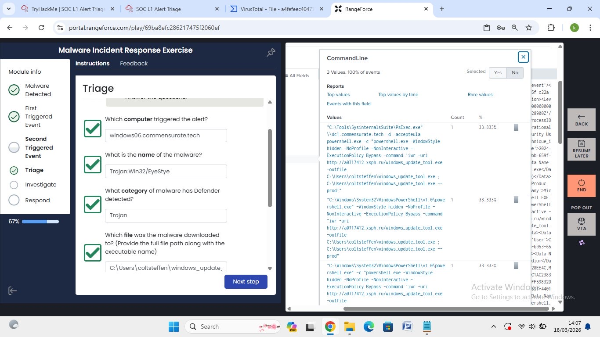
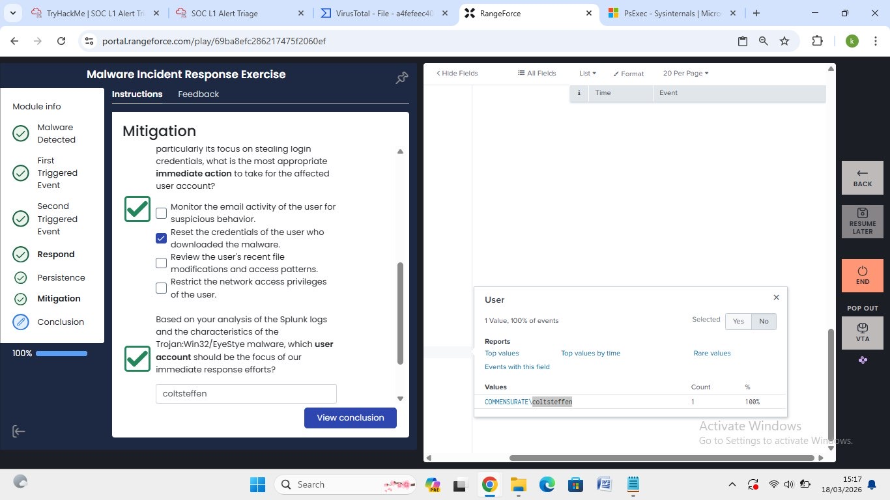
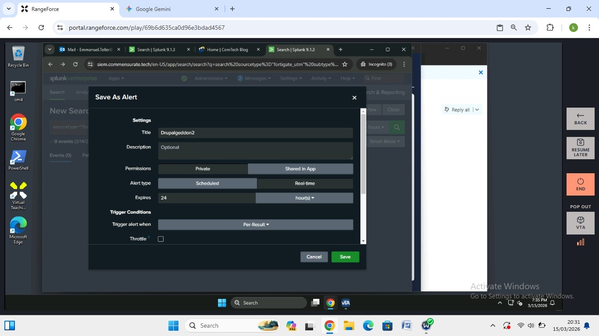
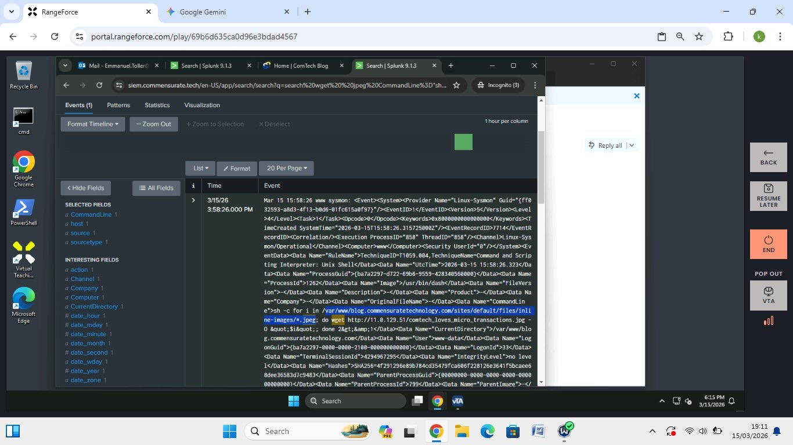

# 📊 Splunk — SOC Investigations

Hands-on SOC investigations and log analysis using
Splunk Enterprise via RangeForce cybersecurity training
platform.

---

## Lab 1: Malware Incident Response — PUABundler

**Platform:** RangeForce
**Date:** March 18, 2026

### Overview
Investigated a malware detection alert triggered on
a Windows workstation using Splunk log analysis.
Completed full triage, investigation, and response
workflow.

### Findings
- **Affected Host:** windows07.commensurate.tech
- **Malware:** PUABundler:Win32/YTDVideoDownload
- **Category:** Potentially Unwanted Software
- **Severity:** Severe
- **Download Path:** C:\Users\autumnbridges\Downloads\YTDSetup.exe
- **Download URL:** http://ytdownloader.tech/YTTSetup.exe
- **Browser Used:** Mozilla Firefox
- **Defender Action:** Quarantine

### Response Actions Taken
- Identified malware download source and URL
- Confirmed Defender quarantined the file
- Recommended blocking the URL on the firewall

### Screenshots

---

## Lab 2: Trojan Detection — EyeStye

**Platform:** RangeForce
**Date:** March 18, 2026

### Overview
Investigated a second triggered alert involving a
Trojan on a separate workstation, using Splunk to
trace the attack chain including PowerShell execution
and credential theft.

### Findings
- **Affected Host:** windows06.commensurate.tech
- **Malware:** Trojan:Win32/EyeStye
- **Category:** Trojan
- **Affected User:** coltsteffen
- **Download Path:** C:\Users\coltsteffen\windows_update.exe
- **Attack Vector:** PowerShell hidden execution via
  PsExec downloading from external IP
- **Immediate Action:** Reset credentials of affected user

### Screenshots

---

## Lab 3: Drupalgeddon2 — Alert Creation & Command Injection

**Platform:** RangeForce
**Date:** March 15, 2026

### Overview
Investigated a web server compromise involving the
Drupalgeddon2 vulnerability. Identified malicious
wget command injected via shell, and created a
real-time Splunk alert for future detection.

### Findings
- **Affected Host:** www (Linux web server)
- **Attack Type:** Command and Scripting Interpreter
  — Unix Shell (MITRE T1059.004)
- **Malicious Command:** wget used to download
  external file from 11.0.129.51
- **Source Path:** /var/www/blog.commensuratetechnology.com
- **Alert Created:** Drupalgeddon2 — Real-time,
  Per-Result trigger

### Screenshots

