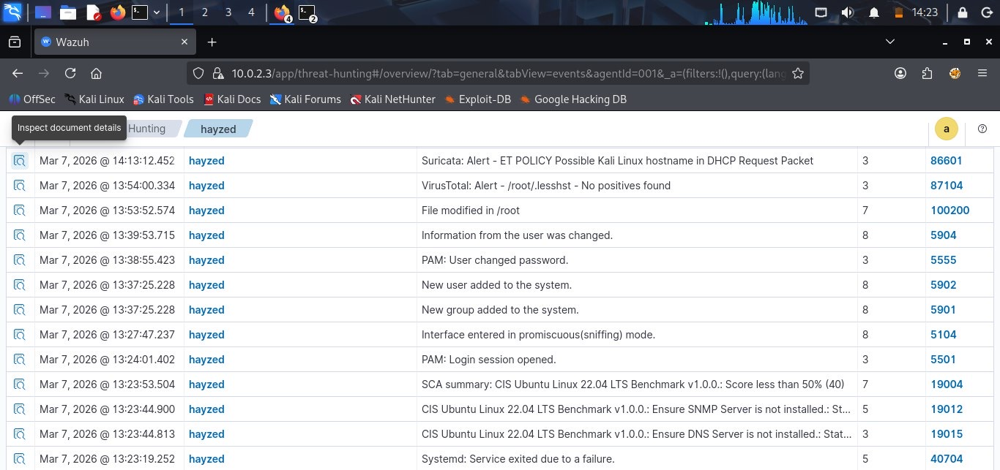
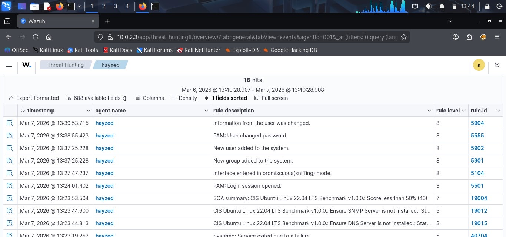
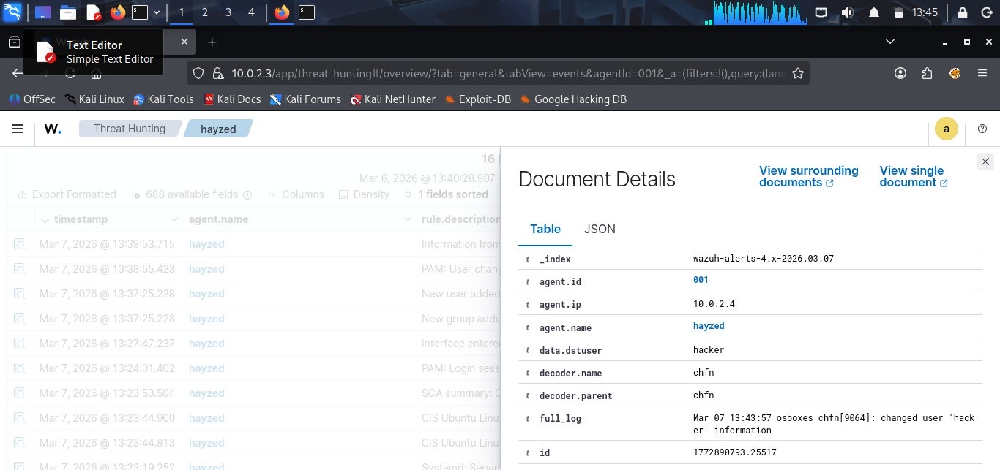
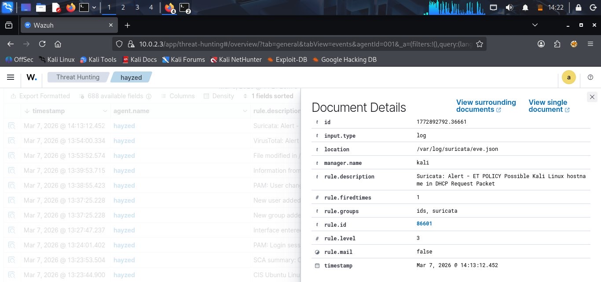

# 🛡️ Wazuh — SIEM Alert Investigation

Hands-on threat hunting and alert investigation using
Wazuh SIEM on a self-hosted Kali Linux environment.

---

## Lab 1: Threat Hunting — Agent hayzed

**Agent:** hayzed (10.0.2.4)
**Date:** March 7, 2026
**Total Events:** 16 hits

### Overview
Performed threat hunting on a monitored Linux agent,
investigating a series of suspicious security events
spanning user activity, network behaviour, and
system configuration changes.

### Alerts Investigated

| Timestamp | Rule Description | Level | Rule ID |
|---|---|---|---|
| 14:13:12 | Suricata: ET POLICY Possible Kali Linux hostname in DHCP Request | 3 | 86601 |
| 13:54:00 | VirusTotal: /root/.lesshst — No positives found | 3 | 87104 |
| 13:53:52 | File modified in /root | 7 | 100200 |
| 13:39:53 | Information from the user was changed | 8 | 5904 |
| 13:38:55 | PAM: User changed password | 3 | 5555 |
| 13:37:25 | New user added to the system | 8 | 5902 |
| 13:37:25 | New group added to the system | 8 | 5901 |
| 13:27:47 | Interface entered promiscuous (sniffing) mode | 8 | 5104 |
| 13:24:01 | PAM: Login session opened | 3 | 5501 |
| 13:23:53 | SCA: CIS Ubuntu Linux 22.04 Benchmark — Score less than 50% | 7 | 19004 |

### Key Findings
- **Promiscuous mode detected** on network interface —
  indicates possible packet sniffing activity
- **New user and group created** — potential
  persistence mechanism
- **User information and password changed** —
  possible account takeover or privilege escalation
- **Suricata IDS alert** triggered for Kali Linux
  hostname detected in DHCP — attacker tooling present
- **CIS Benchmark score below 50%** — system
  hardening posture is critically weak
- **File modified in /root** — suspicious activity
  in privileged directory
- **data.dstuser: hacker** — confirmed malicious
  username on the system

### Document Details
- **Agent ID:** 001
- **Agent IP:** 10.0.2.4
- **Log Source:** /var/log/suricata/eve.json
- **Manager:** kali
- **Index:** wazuh-alerts-4.x-2026.03.07

### Screenshots

