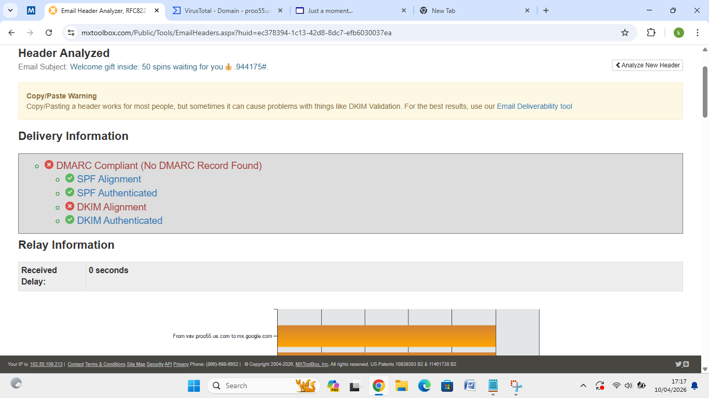
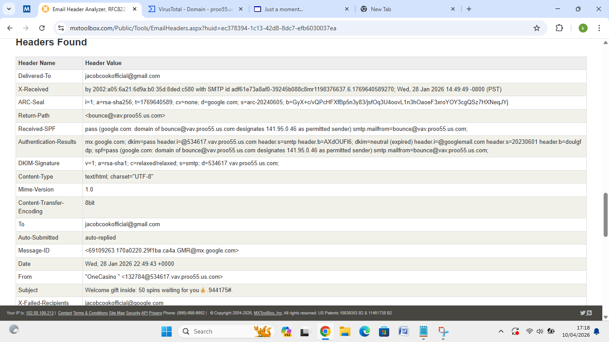

# 📧 MXToolbox — Email Header Analysis

Email header analysis using MXToolbox to investigate
suspicious and potentially malicious emails.

---

## Lab 1: Phishing Email Header Analysis

**Date:** October 4, 2026
**Tool:** MXToolbox Email Header Analyzer

### Overview
Analyzed the email headers of a suspicious promotional
email to determine legitimacy, authentication status,
and potential phishing indicators.

### Email Details
- **Subject:** Welcome gift inside: 50 spins waiting for you
- **From:** "OneCasino" <132784@534617.vav.proo55.us.com>
- **To:** jacobcookofficial@gmail.com
- **Date Sent:** Wed, 28 Jan 2026 22:49:43 +0000
- **Return Path:** bounce@vav.proo55.us.com

### Authentication Results

| Check | Result |
|---|---|
| DMARC | ❌ No DMARC Record Found |
| SPF Alignment | ✅ Pass |
| SPF Authentication | ✅ Pass |
| DKIM Alignment | ❌ Failed |
| DKIM Authentication | ✅ Pass |

### Key Findings
- **No DMARC record** on sending domain — sender
  cannot be verified against domain policy
- **DKIM Alignment failed** — email header domain
  does not match the DKIM signing domain
- **Suspicious sender domain:** vav.proo55.us.com —
  uses a subdomain pattern common in spam/phishing
- **Auto-submitted header present** — indicates
  automated bulk sending
- **X-Failed-Recipients** field present — suggests
  mass email campaign with failed deliveries
- SPF passed but domain is not a recognised
  legitimate casino brand domain

### Verdict
⚠️ **Suspicious — likely phishing/spam**
The combination of no DMARC, DKIM misalignment,
and unrecognised sender domain are strong indicators
of a malicious or spam campaign.

### Screenshots

