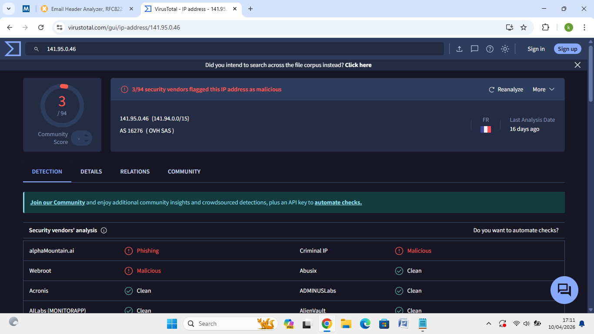
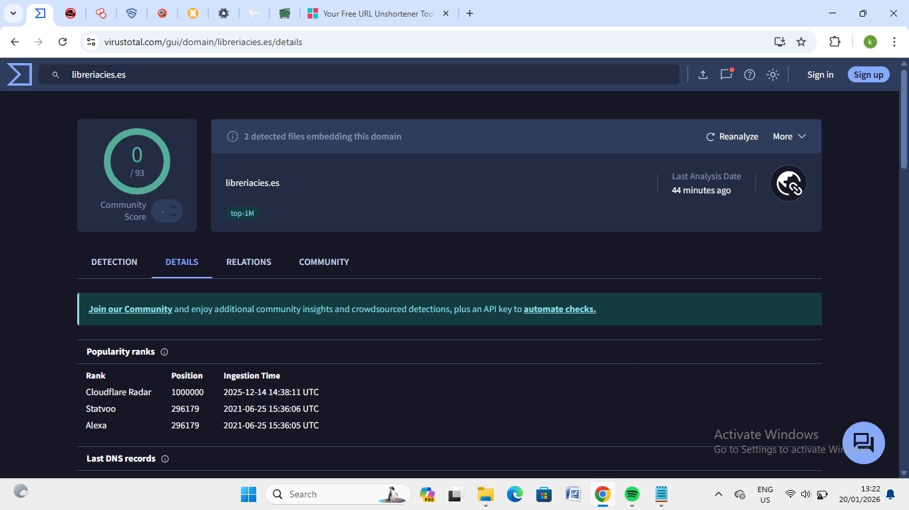
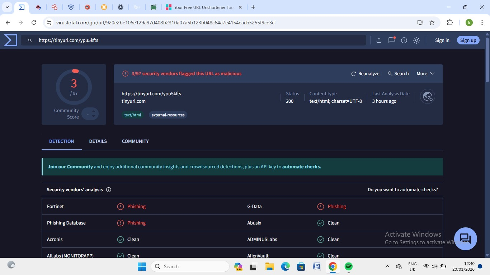
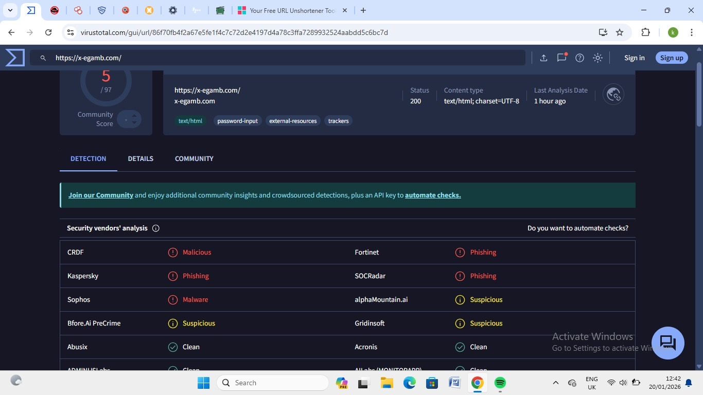
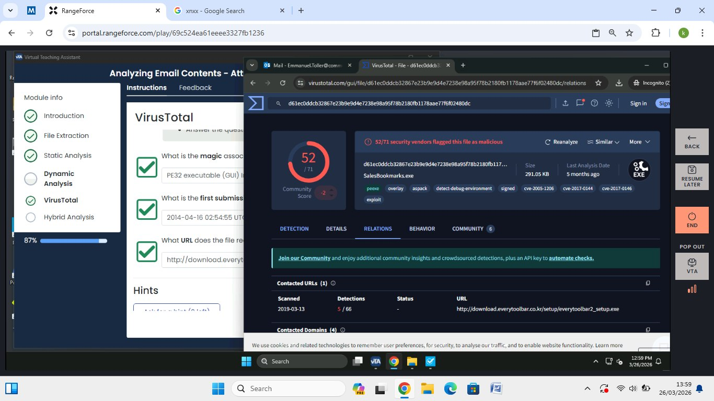

# 🔬 VirusTotal — IOC Analysis & Malware Triage

Threat intelligence investigations using VirusTotal
to analyze malicious IPs, URLs, and files.

---

## Investigation 1: Phishing Email IP & URL Analysis

**Date:** October 4, 2026
**Context:** Follow-up investigation from MXToolbox
phishing email analysis

### IOC 1 — IP Address: 141.95.0.46

| Detail | Value |
|---|---|
| ASN | AS16276 (OVH SAS) |
| Country | France |
| Detections | 3/94 vendors flagged as malicious |
| Vendors | alphaMountain.ai (Phishing), Webroot (Malicious), Criminal IP (Malicious) |

**Verdict:** ⚠️ Malicious — confirmed phishing
infrastructure hosted on OVH

### IOC 2 — URL: https://tinyurl.com/mrymsuhv

| Detail | Value |
|---|---|
| Detections | 2/95 vendors flagged as malicious |
| Tags | multiple-redirects, trackers, external-resources |
| Vendors | Phishing Database (Phishing), SafeToOpen (Phishing) |

**Verdict:** ⚠️ Phishing URL using TinyURL shortener
with multiple redirects

### IOC 3 — URL: https://tinyurl.com/app/nospam/tinyurl.com/mrymsuhv

| Detail | Value |
|---|---|
| Detections | 1/95 vendors flagged as malicious |
| Vendors | SafeToOpen (Phishing) |

**Verdict:** ⚠️ Same phishing destination via
alternate TinyURL path

### Screenshots

---

## Investigation 2: Suspicious URL Analysis

**Date:** January 20, 2026

### IOC 1 — Domain: libreriacies.es

| Detail | Value |
|---|---|
| Detections | 0/93 — Clean |
| Ranking | Alexa/Statvoo position 296,179 |
| Tags | top-1M |

**Verdict:** ✅ Clean — legitimate domain

### IOC 2 — URL: https://tinyurl.com/ypu5kfts

| Detail | Value |
|---|---|
| Detections | 3/97 vendors flagged as malicious |
| Vendors | Fortinet (Phishing), G-Data (Phishing), Phishing Database (Phishing) |

**Verdict:** ⚠️ Phishing URL

### IOC 3 — URL: https://x-egamb.com/

| Detail | Value |
|---|---|
| Detections | 5/97 vendors flagged as malicious |
| Tags | password-input, external-resources, trackers |
| Vendors | CRDF (Malicious), Kaspersky (Phishing), Sophos (Malware), Fortinet (Phishing), SOCRadar (Phishing) |

**Verdict:** 🚨 Malicious — credential harvesting
site flagged by multiple major vendors

### Screenshots

---

## Investigation 3: Malware File Analysis — RangeForce Lab

**Date:** March 26, 2026
**Platform:** RangeForce — Analyzing Email Contents

### IOC — File: SalesBookmarks.exe

| Detail | Value |
|---|---|
| MD5 | d61ec0ddcb32867e23b9e9d4e7238e98a95f78b2180fb1178aae77f6f02480dc |
| File Size | 291.05 KB |
| First Submission | April 16, 2014 |
| Detections | 52/71 vendors flagged as malicious |
| Tags | pexe, overlay, aspack, signed, exploit |
| CVEs | CVE-2005-1206, CVE-2017-0144, CVE-2017-0146 |
| Contacted URL | http://download.everytoolbar.co.kr/setup/everytoolbar2_setup.exe |

**Verdict:** 🚨 Critical — highly malicious executable
with exploit capabilities and known CVE associations

### Screenshot

