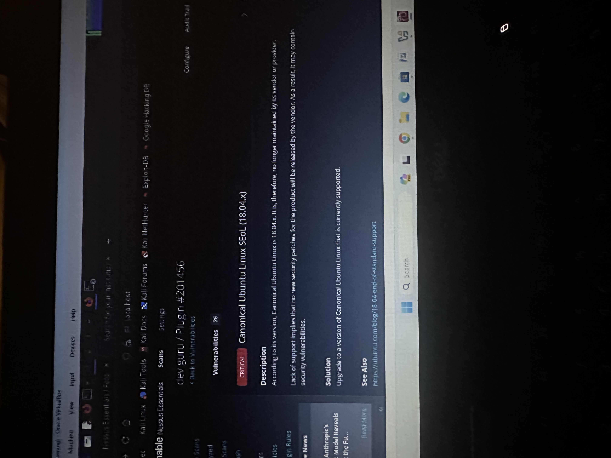
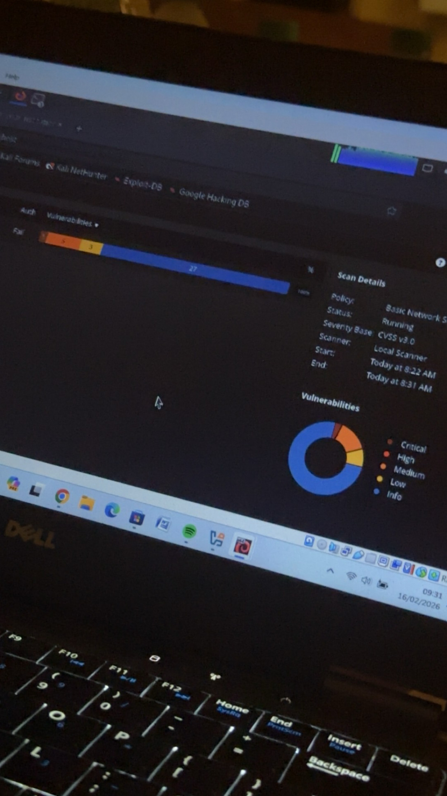

# 🔍 Nessus — Vulnerability Assessment

Vulnerability scanning and assessment using Nessus
Essentials on a local lab environment.

---

## Lab 1: Basic Network Scan — Ubuntu Linux Host

**Target:** dev guru (local host)
**Date:** February 16, 2026
**Tool:** Nessus Essentials
**Policy:** Basic Network Scan
**Severity Base:** CVSS v3.0
**Scanner:** Local Scanner
**Scan Duration:** 8:22 AM — 8:31 AM

### Scan Summary

| Severity | Count |
|---|---|
| Critical | 1 |
| High | 3 |
| Medium | 3 |
| Low | — |
| Info | 27 |

### Critical Finding

**Plugin #201456 — Canonical Ubuntu Linux SEoL (18.04.x)**

- **Severity:** Critical
- **Description:** The target is running Ubuntu Linux
  18.04.x which has reached End of Life and is no
  longer maintained by Canonical
- **Risk:** No new security patches will be released,
  leaving the system exposed to unpatched vulnerabilities
- **Total Vulnerabilities on Host:** 26
- **Remediation:** Upgrade to a currently supported
  version of Ubuntu Linux

### Key Findings
- Running an end-of-life OS is a critical risk as it
  receives no security updates
- 27 informational findings indicate additional
  configuration and service exposure
- High and medium findings require further
  investigation and patching

### Screenshots

